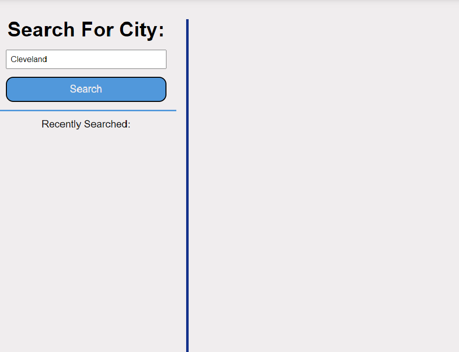
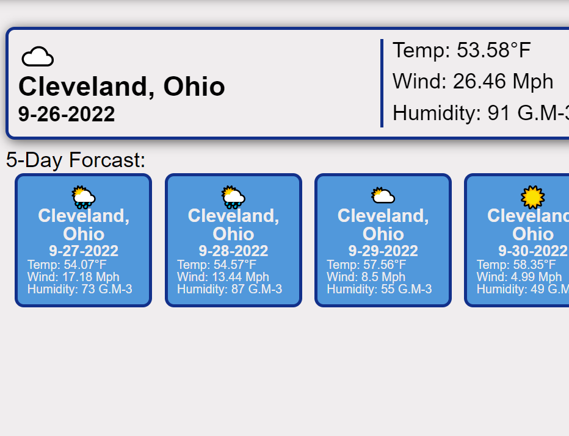
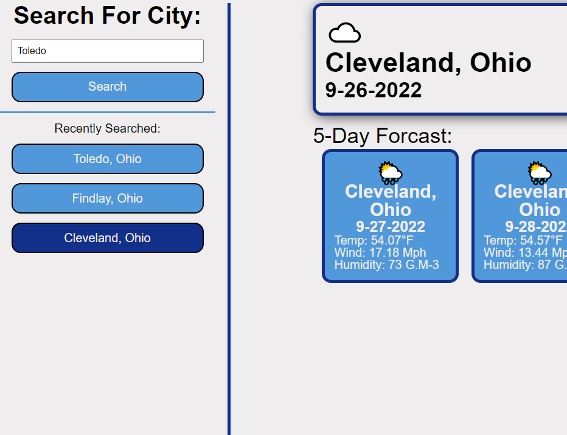

# Weather Dashboard

## Outline

This Website allows you sto search a city and get the weather. When you click on the search button, the website will give you the weather today and 1-5 days later of the city that matches closest with your query.Each day will show the weather (as an emoji), the temperature, the wind speed, and the humidity on a card. Recently searched cities show up in the "recently searched" column. There is a max amount of 8 recent searches at a time and each one is saved to local storage.

